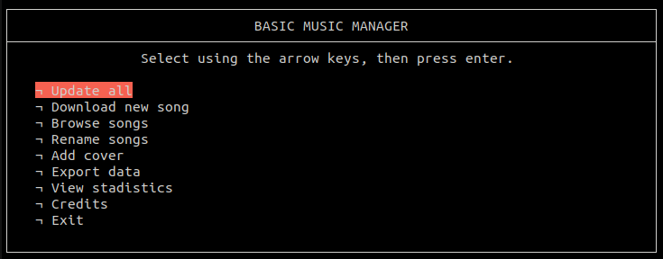
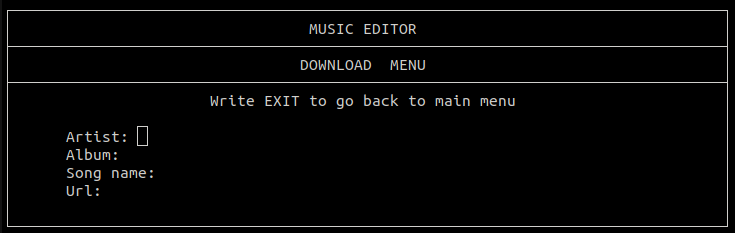
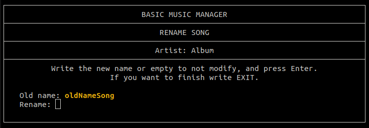
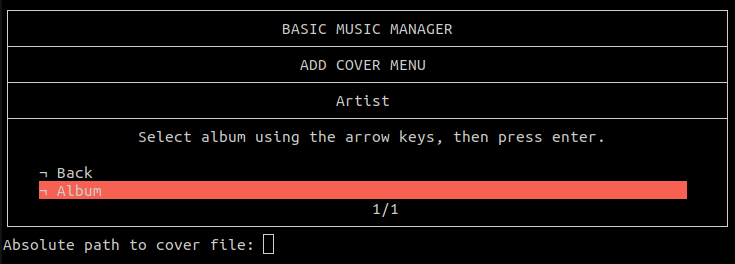
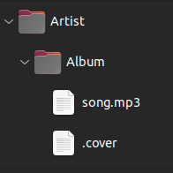

# BasicMusicManager
[](https://github.com/athityakumar/colorls/actions/workflows/ruby.yml)
[](http://makeapullrequest.com)


A Bash script that allows you to easily managed the most common tags for your music, while organizing them in a easy to use directory structure.


## Table of contents

- [Installation](#installation)
- [Uninstallation](#uninstallation)
- [Usage](#usage)
- [Directory Structure](#directory-structure)
- [How to Configure](#how-to-configure)
- [Contributing](#contributing)
- [License](#license)

## Installation

This package requires the following dependencies:

- To modify mp3 tags uses [eyeD3](https://github.com/nicfit/eyeD3).

- To download music uses [yt-dlp](https://github.com/yt-dlp/yt-dlp).

1. Download the .deb file
2. Install it using the Software Manager or installing using

```bash
sudo apt install ./bmm.deb
```

3. Launch the script with `bmm``

## Usage

[(Back to top)](#table-of-contents)

Man pages have been added. Checkout `man bmm`.

### Flags

- With no flags : Opens the command line interface. See also [CLI](#command-line-interface-cli).

The following flags can only be used one at a time

- With `-a` (or) `--artist` : Changes the artist tag in all the songs in the artistName directory to itself. If passed with an album, it only changes the songs inside that album.

```bash
  bmm -a / --artist "ArtistName" ["AlbumName"]
```

- With `-b` (or) `--album` : Changes the album tag for all the songs in the indicated album that belongs to the specified artist to itself.

```bash
  bmm -b / --album "ArtistName" "AlbumName"
```

- With `-d` (or) `--download` : Downloads, stores and sets the corresponding tags with the specified artist, album name and title. Uses yt-dlp.

```bash
  bmm -d / --download Url "ArtistName" "AlbumName" "SongName"
```

- With `-h` (or) `--help` : Prints a help menu

- With `-m` (or) `--mobile` : Not currently working

- With `-n` (or) `--new` : Creates a new artist directory and asks to create new albums for that artist.

```bash
  bmm -n / --new "ArtistName"
```

- With `--rename` : Opens the rename interface to rename all of the songs available in the music gallery. See also [CLI](#command-line-interface-cli).

```bash
  bmm --rename
```

### Command Line Interface (CLI)

- Main menu: select the desired submenu using the arrow keys and press Enter.


- Update menu: Updates the tags based on the directories the songs are in, also creates the `.Statistics` file that includes the satistics of all the music library, such as name and number of albums, and songs and the duration of each one.

- Download menu: downloads, stores and sets the corresponding tags with the specified artist, album name and title. Uses yt-dlp.


- Browse menu: browse in the music gallery and add new songs, albums and artists.

- Rename menu: same as the browse menu, search which songs to rename, and opens them in the rename interface. Can select to rename all the songs of an artist, of an album, or only a single song.


- Add cover menu: select an album to add a cover, and write the absolute path to the cover image to set it as the cover for all the songs inside the album.
It also changes the icon in nautilus of the album folder and the songs to match the cover. The cover is saved inside the album as `.cover`.


- Export menu: compresses the entire music directory as a .tgz file, and saves it inside as MyMusic.tgz.

- Statistics menu: WORK IN PROGRESS. Currently it just does `cat .Statistics`.

## Directory Structure

[(Back to top)](#table-of-contents)

The directory structure created to manage the music library follows the next structure: Artists -> Albums -> Songs



## How to Configure

[(Back to top)](#table-of-contents)

Modify the file in `/etc/bmm.conf` to change the page size, the icon, the music directory (Defualt is $HOME/Music), where to save the statistics file, and also to allow notifications (Turned on by default).
[(Back to top)](#table-of-contents)

## Uninstallation

[(Back to top)](#table-of-contents)

If install using apt, just do: `sudo apt remove bmm`

## Contributing

[(Back to top)](#table-of-contents)

Your contributions are always welcome! Please have a look at the [contribution guidelines](CONTRIBUTING.md) first.

## License

[(Back to top)](#table-of-contents)

The GPL-3.0 License (GNU) 2023 - [Javier Izquierdo](https://github.com/javizqh/). Please have a look at the [LICENSE](LICENSE) for more details.
